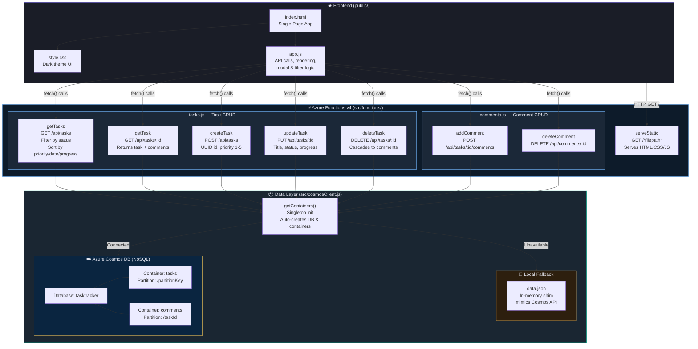
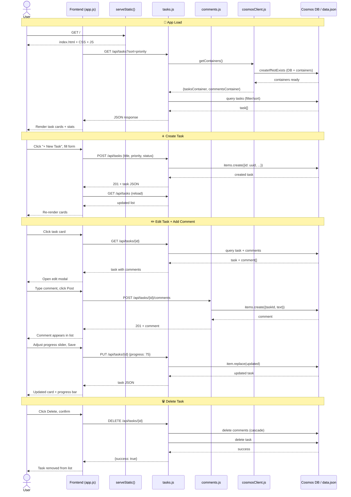

# Task Tracker — Architecture & Code Flow

## Architecture Diagram

```mermaid
graph TB
    subgraph CLIENT["🌐 Frontend (public/)"]
        HTML["index.html<br/>Single Page App"]
        CSS["style.css<br/>Dark theme UI"]
        JS["app.js<br/>API calls, rendering,<br/>modal & filter logic"]
        HTML --> CSS
        HTML --> JS
    end

    subgraph AZURE_FUNCTIONS["⚡ Azure Functions v4 (src/functions/)"]
        direction TB
        STATIC["serveStatic<br/>GET /*filepath*<br/>Serves HTML/CSS/JS"]

        subgraph TASK_API["tasks.js — Task CRUD"]
            GET_ALL["getTasks<br/>GET /api/tasks<br/>Filter by status<br/>Sort by priority/date/progress"]
            GET_ONE["getTask<br/>GET /api/tasks/:id<br/>Returns task + comments"]
            CREATE["createTask<br/>POST /api/tasks<br/>UUID id, priority 1-5"]
            UPDATE["updateTask<br/>PUT /api/tasks/:id<br/>Title, status, progress"]
            DELETE["deleteTask<br/>DELETE /api/tasks/:id<br/>Cascades to comments"]
        end

        subgraph COMMENT_API["comments.js — Comment CRUD"]
            ADD_CMT["addComment<br/>POST /api/tasks/:id/comments"]
            DEL_CMT["deleteComment<br/>DELETE /api/comments/:id"]
        end
    end

    subgraph DATA_LAYER["📦 Data Layer (src/cosmosClient.js)"]
        COSMOS_CLIENT["getContainers()<br/>Singleton init<br/>Auto-creates DB & containers"]
        COSMOS_CLIENT -->|"Connected"| COSMOS_DB
        COSMOS_CLIENT -->|"Unavailable"| LOCAL_JSON
    end

    subgraph COSMOS_DB["☁️ Azure Cosmos DB (NoSQL)"]
        DB["Database: tasktracker"]
        TASKS_C["Container: tasks<br/>Partition: /partitionKey"]
        COMMENTS_C["Container: comments<br/>Partition: /taskId"]
        DB --- TASKS_C
        DB --- COMMENTS_C
    end

    subgraph LOCAL_JSON["💾 Local Fallback"]
        JSON_FILE["data.json<br/>In-memory shim<br/>mimics Cosmos API"]
    end

    JS -->|"fetch() calls"| GET_ALL
    JS -->|"fetch() calls"| GET_ONE
    JS -->|"fetch() calls"| CREATE
    JS -->|"fetch() calls"| UPDATE
    JS -->|"fetch() calls"| DELETE
    JS -->|"fetch() calls"| ADD_CMT
    JS -->|"fetch() calls"| DEL_CMT

    CLIENT -->|"HTTP GET /"| STATIC

    GET_ALL --> COSMOS_CLIENT
    GET_ONE --> COSMOS_CLIENT
    CREATE --> COSMOS_CLIENT
    UPDATE --> COSMOS_CLIENT
    DELETE --> COSMOS_CLIENT
    ADD_CMT --> COSMOS_CLIENT
    DEL_CMT --> COSMOS_CLIENT

    style CLIENT fill:#1a1d27,stroke:#6c5ce7,color:#e4e6f0
    style AZURE_FUNCTIONS fill:#0d1b2a,stroke:#74b9ff,color:#e4e6f0
    style TASK_API fill:#1b2838,stroke:#74b9ff,color:#e4e6f0
    style COMMENT_API fill:#1b2838,stroke:#74b9ff,color:#e4e6f0
    style DATA_LAYER fill:#1a2632,stroke:#00b894,color:#e4e6f0
    style COSMOS_DB fill:#0a2540,stroke:#feca57,color:#e4e6f0
    style LOCAL_JSON fill:#2d1f0e,stroke:#fdcb6e,color:#e4e6f0
```

## Request/Response Flow

```mermaid
sequenceDiagram
    actor User
    participant UI as Frontend (app.js)
    participant Static as serveStatic()
    participant Tasks as tasks.js
    participant Comments as comments.js
    participant DB as cosmosClient.js
    participant Store as Cosmos DB / data.json

    Note over User, Store: 🚀 App Load
    User->>Static: GET /
    Static-->>User: index.html + CSS + JS
    UI->>Tasks: GET /api/tasks?sort=priority
    Tasks->>DB: getContainers()
    DB->>Store: createIfNotExists (DB + containers)
    Store-->>DB: containers ready
    DB-->>Tasks: {tasksContainer, commentsContainer}
    Tasks->>Store: query tasks (filter/sort)
    Store-->>Tasks: task[]
    Tasks-->>UI: JSON response
    UI-->>User: Render task cards + stats

    Note over User, Store: ➕ Create Task
    User->>UI: Click "+ New Task", fill form
    UI->>Tasks: POST /api/tasks {title, priority, status}
    Tasks->>Store: items.create({id: uuid, ...})
    Store-->>Tasks: created task
    Tasks-->>UI: 201 + task JSON
    UI->>Tasks: GET /api/tasks (reload)
    Tasks-->>UI: updated list
    UI-->>User: Re-render cards

    Note over User, Store: ✏️ Edit Task + Add Comment
    User->>UI: Click task card
    UI->>Tasks: GET /api/tasks/{id}
    Tasks->>Store: query task + comments
    Store-->>Tasks: task + comment[]
    Tasks-->>UI: task with comments
    UI-->>User: Open edit modal

    User->>UI: Type comment, click Post
    UI->>Comments: POST /api/tasks/{id}/comments
    Comments->>Store: items.create({taskId, text})
    Store-->>Comments: comment
    Comments-->>UI: 201 + comment
    UI-->>User: Comment appears in list

    User->>UI: Adjust progress slider, Save
    UI->>Tasks: PUT /api/tasks/{id} {progress: 75}
    Tasks->>Store: item.replace(updated)
    Store-->>Tasks: updated task
    Tasks-->>UI: task JSON
    UI-->>User: Updated card + progress bar

    Note over User, Store: 🗑️ Delete Task
    User->>UI: Click Delete, confirm
    UI->>Tasks: DELETE /api/tasks/{id}
    Tasks->>Store: delete comments (cascade)
    Tasks->>Store: delete task
    Store-->>Tasks: success
    Tasks-->>UI: {success: true}
    UI-->>User: Task removed from list
```
