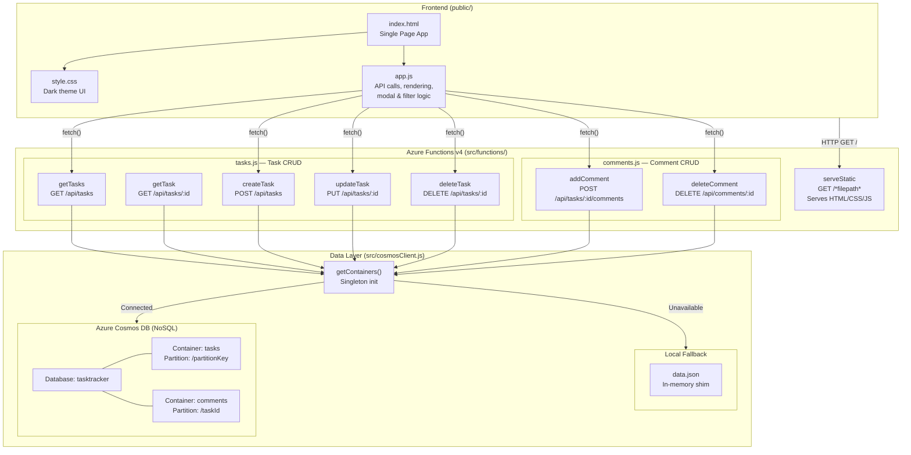
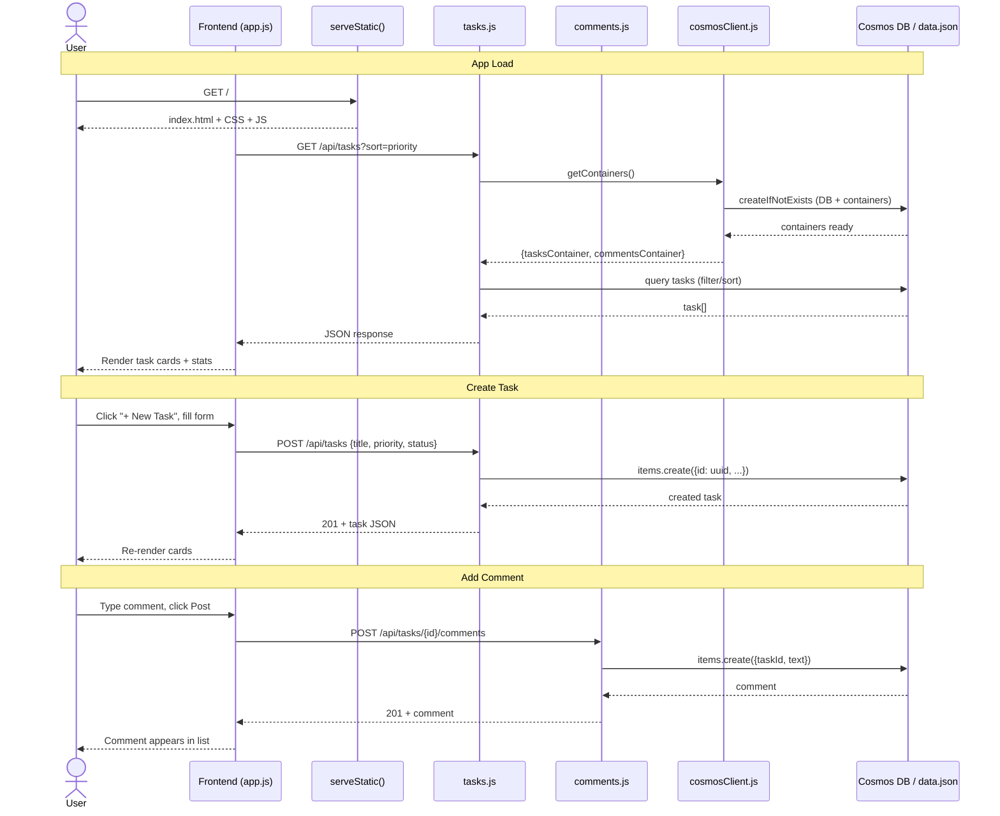

# Task Tracker

A full-stack task and progress tracking web application built with **Azure Functions v4** and **Azure Cosmos DB**, developed entirely through AI-assisted pair programming with GitHub Copilot.


---

## Features

- **Task CRUD** — Create, read, update, and delete tasks with title, description, status, and priority (1–5)
- **Progress Tracking** — Visual progress bar (0–100%) per task with color-coded status
- **Comments** — Add and delete threaded comments on each task
- **Filtering & Sorting** — Filter tasks by status; sort by priority, date, or progress
- **Dashboard Stats** — Live counters for total, active, and completed tasks
- **Dark Theme UI** — Clean single-page app with responsive design
- **Dual-Mode Storage** — Azure Cosmos DB in production, local JSON file fallback for development
- **Serverless** — Runs on Azure Functions consumption plan (pay-per-execution)

---

## Tech Stack

| Layer | Technology |
|-------|-----------|
| Frontend | Vanilla HTML/CSS/JS (SPA) |
| Backend | Azure Functions v4 (Node.js 20) |
| Database | Azure Cosmos DB NoSQL (serverless) |
| Local Dev | JSON file with Cosmos API shim |
| Deployment | Azure CLI + zip deploy |
| CI/CD | GitHub + deploy.ps1 script |

---

## Architecture



### Request Flow



---

## Project Structure

```
task-tracker/
├── public/                    # Frontend SPA
│   ├── index.html             # Main HTML with modals
│   ├── style.css              # Dark theme styles
│   └── app.js                 # Client-side logic & API calls
├── src/
│   ├── cosmosClient.js        # Cosmos DB client + local JSON shim
│   └── functions/
│       ├── tasks.js           # 5 HTTP triggers for task CRUD
│       ├── comments.js        # 2 HTTP triggers for comments
│       └── static.js          # Static file server
├── host.json                  # Azure Functions host config
├── package.json               # Dependencies & scripts
├── deploy.ps1                 # Azure deployment script
├── local.settings.sample.json # Environment variable template
├── ARCHITECTURE.md            # Detailed Mermaid diagrams
├── .gitignore                 # Excludes secrets & node_modules
└── .funcignore                # Excludes files from Azure deploy
```

---

## Getting Started

### Prerequisites

- [Node.js](https://nodejs.org/) 20+
- [Azure Functions Core Tools](https://learn.microsoft.com/azure/azure-functions/functions-run-local) v4
- (Optional) [Azure CLI](https://learn.microsoft.com/cli/azure/) for deployment

### Local Development

```bash
# Clone the repo
git clone https://github.com/nikhilnimmagadda/task-tracker.git
cd task-tracker

# Install dependencies
npm install

# Start locally (uses JSON file fallback — no Cosmos DB needed)
npm start
# App runs at http://localhost:7071
```

### Connect to Cosmos DB (Optional)

1. Copy `local.settings.sample.json` → `local.settings.json`
2. Fill in your Cosmos DB endpoint and key
3. Restart the function app

### Deploy to Azure

```powershell
# Login to Azure
az login

# Run the deployment script
.\deploy.ps1
```

The script creates all required Azure resources (Resource Group, Cosmos DB, Storage Account, Function App) and deploys the code.

---

## API Endpoints

| Method | Endpoint | Description |
|--------|----------|-------------|
| `GET` | `/api/tasks` | List tasks (query: `?status=`, `?sort=`) |
| `GET` | `/api/tasks/:id` | Get task with comments |
| `POST` | `/api/tasks` | Create task |
| `PUT` | `/api/tasks/:id` | Update task |
| `DELETE` | `/api/tasks/:id` | Delete task + cascade comments |
| `POST` | `/api/tasks/:taskId/comments` | Add comment |
| `DELETE` | `/api/comments/:id` | Delete comment |

---

## Challenges & Learnings (AI-Driven Development)

This project was built end-to-end through AI pair programming. Below are the real challenges encountered and how they were resolved — a transparent log of AI-assisted development.

### 1. Database Selection & Migration

**Challenge:** The initial approach used `better-sqlite3`, which requires native C++ compilation. The build failed in the Azure Functions Node.js environment.

**Resolution:** The AI evaluated three database options (SQLite, Azure SQL, Cosmos DB), recommended Cosmos DB for its serverless model and native Azure integration, and restructured the entire backend — replacing Express.js routes with Azure Functions v4 HTTP triggers and adding a Cosmos DB SDK client. A local JSON file shim was created to allow development without a database connection.

**Learning:** Serverless apps benefit from serverless databases. Cosmos DB's pay-per-request model pairs naturally with Azure Functions' pay-per-execution model, keeping costs near zero for low-traffic apps.

### 2. Cosmos DB Provider Registration

**Challenge:** Creating the Cosmos DB account failed with: *"Resource provider 'Microsoft.DocumentDB' is not registered for subscription."*

**Resolution:** Ran `az provider register --namespace Microsoft.DocumentDB` and waited ~90 seconds for propagation before retrying. The AI recognized this as a common first-time Azure setup issue.

**Learning:** Azure resource providers must be registered per subscription before first use. This is a one-time operation that's easy to miss in documentation.

### 3. Deployment Package Size (545 MB → 8.7 MB)

**Challenge:** The initial `func azure functionapp publish` failed because the deployment package was 545 MB — `azure-functions-core-tools` (a CLI tool) was listed as a `devDependency` and was being included in the zip.

**Resolution:** Removed development dependencies from the package, ran `npm prune --production`, and repackaged. The deployment dropped from 545 MB to 8.76 MB.

**Learning:** Always audit `devDependencies` vs `dependencies`. Build/CLI tools should never ship to production. The `--production` flag and `.funcignore` are critical for lean deployments.

### 4. Cosmos DB Composite Index Requirement

**Challenge:** Multi-field `ORDER BY` queries (e.g., `ORDER BY c.priority DESC, c.createdAt DESC`) failed with: *"Order-by item requires a corresponding composite index."*

**Resolution:** Rather than defining composite indexes (which add complexity and RU cost on serverless), the AI moved sorting to in-memory JavaScript after fetching the filtered results. Since task lists are typically small (hundreds, not millions), this trade-off is acceptable.

**Learning:** Cosmos DB requires composite indexes for multi-field sorting — unlike SQL databases. For small datasets, in-memory sorting after a simple query is simpler and cheaper than maintaining composite indexes.

### 5. Static File Serving from Azure Functions

**Challenge:** Azure Functions doesn't have built-in static file hosting like Express.js. The SPA frontend needed to be served from the same origin to avoid CORS issues.

**Resolution:** Created a catch-all `serveStatic` function with route `{*filepath}` that reads files from the `public/` directory and serves them with correct MIME types. Set `routePrefix: ""` in `host.json` so the root URL serves the app, while API routes are explicitly prefixed with `/api/`.

**Learning:** Azure Functions can serve static files, but it requires manual MIME type mapping and route configuration. For larger apps, Azure Static Web Apps would be a better fit, but for a small SPA this approach keeps everything in one deployable unit.

### 6. Remote Build Failures (403 Forbidden)

**Challenge:** `func azure functionapp publish --build remote` returned a 403 Forbidden error on the Linux consumption plan.

**Resolution:** Switched to local zip upload (`func azure functionapp publish <name>` without `--build remote`), which packages locally and pushes the zip directly. Since there are no native dependencies, a remote build wasn't necessary.

**Learning:** Remote build on Linux consumption plans can be unreliable. If your dependencies are pure JavaScript (no native modules), local packaging with zip deploy is simpler and more reliable.

### 7. Secrets Management

**Challenge:** Cosmos DB connection strings and keys were stored in `local.settings.json`, which could easily leak to source control.

**Resolution:** Added `local.settings.json` to `.gitignore`, created `local.settings.sample.json` with placeholder values, and configured production secrets as App Settings in the Azure Function App (set via `az functionapp config appsettings set`).

**Learning:** Never commit secrets. Use gitignored local config files for development and platform-managed settings (Azure App Settings, GitHub Secrets) for production.

---

## Key Takeaways

| Area | Insight |
|------|---------|
| **Architecture** | Azure Functions + Cosmos DB serverless is a cost-effective stack for small CRUD apps |
| **Development** | A local JSON shim that mimics the Cosmos API enables offline development without emulators |
| **Deployment** | Lean packaging (`npm prune --production`) is critical for serverless cold start times |
| **AI Pairing** | AI can handle full-stack development, but real-world deployment reveals edge cases (provider registration, composite indexes, package sizes) that require iterative debugging |
| **Iteration** | Every challenge above was encountered and resolved in a single session — the AI adapted its approach based on error output rather than giving up |

---

## Live Demo

**Production URL:** https://taskstracker-func.azurewebsites.net

---

## License

MIT
